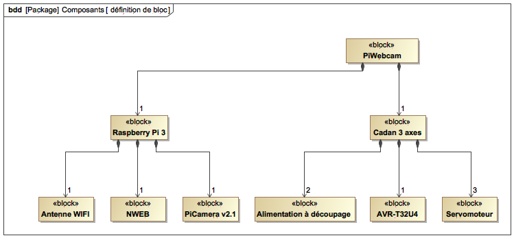
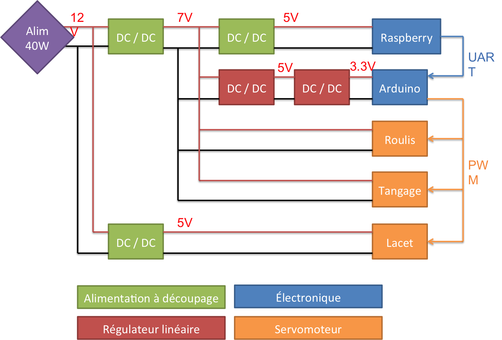
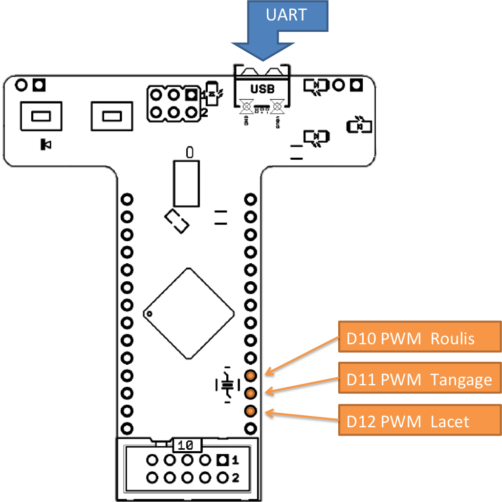

# PiWebcam
Ce projet, proposé en M2 FeSUP GE à l'école normale supérieure Paris-Saclay, a pour objectif de réaliser un système permettant de commander l’orientation d’une webcam à partir d’un serveur web embarqué. Il est réaliser à partir d'une RaspberryPi3 et d'un AVR-T32U4 (similaire à une Arduino Leonardo)


Nous décrirons dans ce manuel le fonctionnement Hardware du système, l'utilisation des différents bouts de code et nous détailleront l'installation et la configuration de la Raspberry Pi.

Le plan adopté sera la suivant :
1. Description globale du système ;
2. Configuration du Microcontrôleur ;
3. Configuration de l'ensemble du système Linux sur RaspberryPi3.

## Description globale du système
Le système PiWebcam répond à la problématique suivante.
> Piloter une webcam à distance en commandant sa direction et son zoom à l’aide d’un serveur embarqué.

La partie matériel, nommé *Cadan 3 axes* et permettant l'orientation de la caméra, est issue dans projet ultérieur. Seul l'étage d'alimentation a été révisé et une RaspberryPi3 + PiCamera ajoutées.



### Cadan 3 axes
Cette partie est composée de 2 servomoteurs commandés en position assurant la rotation de la caméra autour du roulis et du tangage, et d'un servomoteur modifié assurant la rotation de la caméra autour du lacet. La butée mécanique ayant été retirée et le potentiomètre de recopie ayant été remplacé par un pont diviseur de tension, ce servomoteur est alors commandé en vitesse et permet une rotation totale de la caméra autour du lacet.

AJOUT PHOTO

Le schéma suivant décrit sommairement le système.

AJOUT PHOTO

L’étage d'alimentation est situé dans la botte du système et est assuré par 2 alimentations à découpage (*LM2596* et *MP2307*) délivrant (respectivement) 5V et 7V. Le dossier `EAGLE` étant disponible dans l'archive du projet.
* Les 5V permettent l’alimentation du servomoteur inférieure assurant la rotation autour du lacet
* Les 7V permettent l’alimentation des servomoteurs restants, du microcontrôleur, et de la Raspberry. Deux régulateurs linéaires (*L7805CV* et ??) permettent de fournir les 3.3V au microcontrôleur et une 3e alimentation à découpage (*MP2307*) permet de fournir 5V à la Raspberry.

Le schéma suivant illustre l'alimentation du système.



La carte de développement utilisé est une *AVR-T32U4* dont l'architecture est inspiré d’un *Arduino Leonardo*. Elle peut être être programmée à partir de l’*IDE Arduino*.
Le rôle du microcontrôleur est d'assuré le pilotage des 3 servomoteurs.



La communication entre la Raspberry Pi et le microcontrôleur est assuré par différent type de liaison (I2C, SPI, UART). La liaison Série UART à travers le câble USB a été retenu pour 2 raisons principales : sa facilité de mise en oeuvre et la possibilité de flasher l'*AVR-T32U4* à distance via une connection *ssh*.

### RaspberryPi3 + PiCamera
A COMPLETER

## Configuration du Microcontrôleur
Pour configurer le microcontroleur AVR-T32U4, il est nécessaire de télécharger l'environnement [Arduino IDE](https://www.arduino.cc/en/Main/Software). Il ne vous restera plus qu'à flasher la carte (en choissisant *Arduino Leonardo*) avec le code *.ino* disponible dans le dossier `Arduino/sketch_mar28a`.

Par défaut, ce code vous permettra de commander les servomoteurs via une communication unidirectionnelle Série UART du PC vers le port micro-USB de la carte à la vitesse de *9600 baud*.

Les messages à envoyer sont répertoriés ci-dessous.

| Octet | Signification |
| - | - |
| `#` | Retour à la position d'origine |
| `@` | Stopper le mouvement et maintenir la position |
| `U` | Rotation autour du tangage dans le sens positif |
| `D` | Rotation autour du tangage dans le sens négatif |
| `R` | Rotation autour du lacet dans le sens positif |
| `L` | Rotation autour du lacet dans le sens positif |
| `W` | Rotation autour du roulis dans le sens positif |
| `V` | Rotation autour du roulis dans le sens négatif |

Il est possible d'envoyer un ordre similtannément au 3 servomoteurs en envoyer l'octet `#` suivit respectivement des positions angulaires des servomoteurs roulis, tangage et de la vitesse angulaire du servomoteur lacet, séparé par un caractère quelconque.

Par exemple : `#350/-260/40`

## Configuration de l'ensemble du système Linux sur RaspberryPi3
1. Installation de Raspbian ;
2. Configuration du point d’accès Wifi ;
3. Configuration du streaming la vidéo pour une PiCamera ;
4. Installation du serveur *nweb* modifié ;
5. Configuration de la communication Série entre l'Arduino et Linux TTY ;
6. Configuration du lancement automatique des différents process au démarrage du système.

Une fois configuré le serveur est accéssible à l'adresse `192.168.3.1:8081` sous réserve d'être connecté au réseau Wifi `PiWebcam`.

### Installation de Raspbian
Pour télécharger l'image, rendez-vous sur la [page officiel](https://www.raspberrypi.org/downloads/raspbian/).
Suivez le [guide d'installation](https://www.raspberrypi.org/documentation/installation/installing-images/) si vous ne savez pas (ou plus) comment installer cette image sur une carte SD.

### Configuration du point d’accès Wifi
La configuration du point d'accès Wifi est inspiré de [ce tutoriel](https://www.g33k-zone.org/post/2016/05/11/Configurer-le-Raspberry-Pi-en-point-d-acc%C3%A8s-Wifi)

TEXTE DE REMI

### Configuration du streaming la vidéo pour une PiCamera
Pour le streaming vidéo, nous utilisons le package *mjpg-streamer*. [Pour plus d'informations...](https://doc.ubuntu-fr.org/mjpg-streamer)

L'installation se fait à l'aide des commandes suivantes.
```
sudo apt-get install subversion
sudo apt-get install libjpeg62-dev
svn checkout svn://svn.code.sf.net/p/mjpg-streamer/code/  mjpg-streamer
cd
make
sudo make install
```

Pour pouvoir lancer le streaming de PiCaméra, il faut charger le module `bcm2835-v4l2` à l'aide de cette commande à chaque démarrage de la Raspberry. [Pour plus d'informations...](http://www.epingle.info/?p=3224)
```
sudo modprobe bcm2835-v4l2
```

Pour éviter d’avoir à exécuter cette commande à chaque démarrage, il suffit d’ajouter le module `bcm2835-v4l2` à l’ensemble des modules lancés par Linux au démarrage en ajoutant le nom du module à la fin du fichier  `/etc/modules`.

La vérification de l'existence de `/dev/video0` permet de savoir sur le module s’est bien lancer au démarrage.

Le streaming vidéo se lance à l'aide de la commande suivante.
```
mjpg_streamer -i “/usr/local/lib/input_uvc.so -d /dev/video0 -f 24 -r 320x180” -o “/usr/local/lib/output_http.so -n -w /usr/local/www -p 8001”
```
Rendant accéssible le flux vidéo à l'adresse `192.168.3.1:8001`.

### Installation du serveur *nweb* modifié
La serveur web mis en oeuvre repose sur le serveur *nweb* proposé par [Ankush Agarwal](https://github.com/ankushagarwal/nweb). Nous l'avons légèrement modifié pour qu'il prennent en compte la gestion de *cgi*.

Pour l'installer, placez le dossier `server` contenant le site dans un répertoire sensible (et non pas dans un répertoire système comme `/` ou `/temp`). Par exemple dans `/home`. Puis rendez le lisible.
```
chmod ugo+r /home/server
```
Compilez le serveur *nweb* et rendez le executable.
```
cc /home/Raspberry/nweb23.c -o /home/Raspberry/nweb
chmod r+x /home/Raspberry/nweb
```
Décidez ensuite du numéro de port que vous utilisez (ici *8081*). Puis lancez *nweb* à l'aide de la commande suivante.
```
/home/Raspberry/nweb 8081 /home/Raspberry/server
```

### Configuration de la communication Série entre l'Arduino et Linux TTY
Pour configurer la connection Série entre la Raspberry et l'Arduino avec la bonne parité, vitesse... [Pour plus d'info...](http://playground.arduino.cc/Interfacing/LinuxTTY)
```
stty -F /dev/ttyACM0 cs8 9600 ignbrk -brkint -icrnl -imaxbel -opost -onlcr -isig -icanon -iexten -echo -echoe -echok -echoctl -echoke noflsh -ixon -crtscts
```

Pour envoyer un String à l'Arduino.
```
#Avec fin de ligne
echo "Hello Arduino" > /dev/ttyUSB0

#Sans fin de ligne
echo -n "Hello" > /dev/ttyUSB0
```

Pour lire un String envoyé de l'Arduino.
```
tail -f /dev/ttyUSB0
```

### Lancement des différents process au démarrage de la Raspberry
Le lancement du serveur *nweb* et du streaming vidéo au démarrage de la Raspberry se fait via le fichier *lancementServeur.sh*.

Déplacez le script shell dans le répertoire `init.d` qui contient les différents scripts lancés au démarrage, et rendait le executable via les commandes suivantes.

```
sudo mv /home/nweb/lancementServeur.sh /etc/init.d/lancementServeur
sudo chmod r+x /etc/init.d/lancementServeur
```

Les liens symboliques associés au fichier *lancementServeur* pour son démarrage et son arrêt au lancement et à l'arrêt de la Raspberry.
```
sudo update-rc.d lancementServeur defaults
```
Le lien symbolique créé dans `rc3.d` est `S02lancementserveur`. Nous pouvons renommer le lien en `S99lancementserveur` pour qu'il se lance en dernier.
