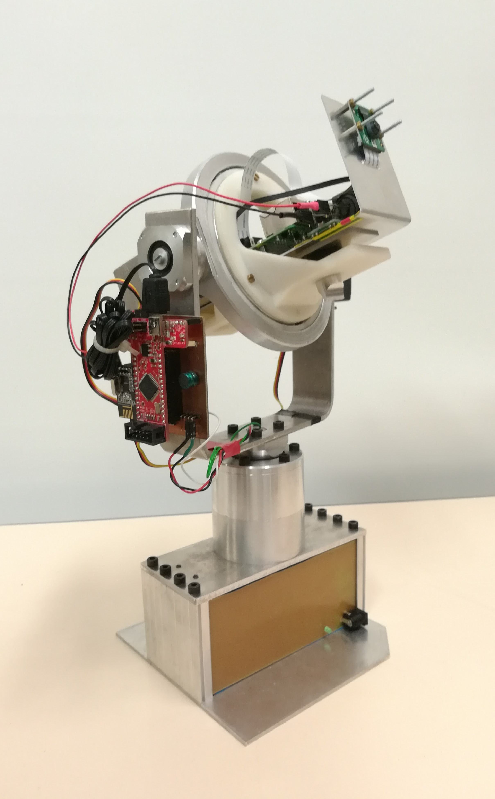
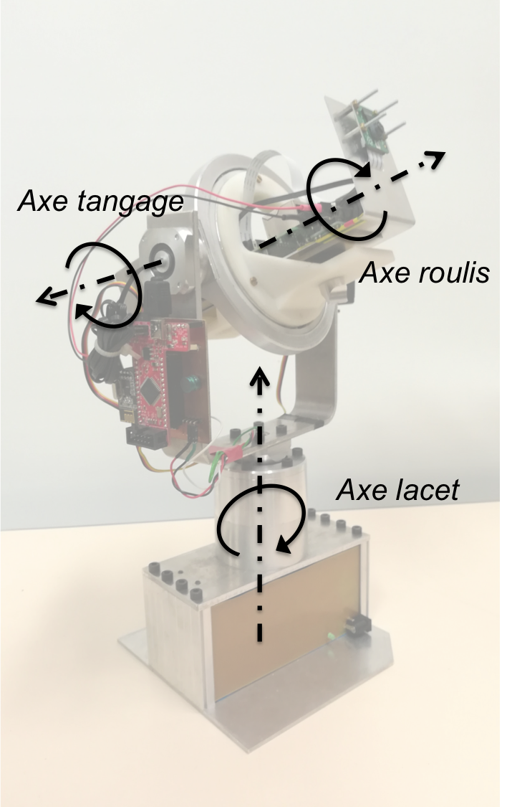
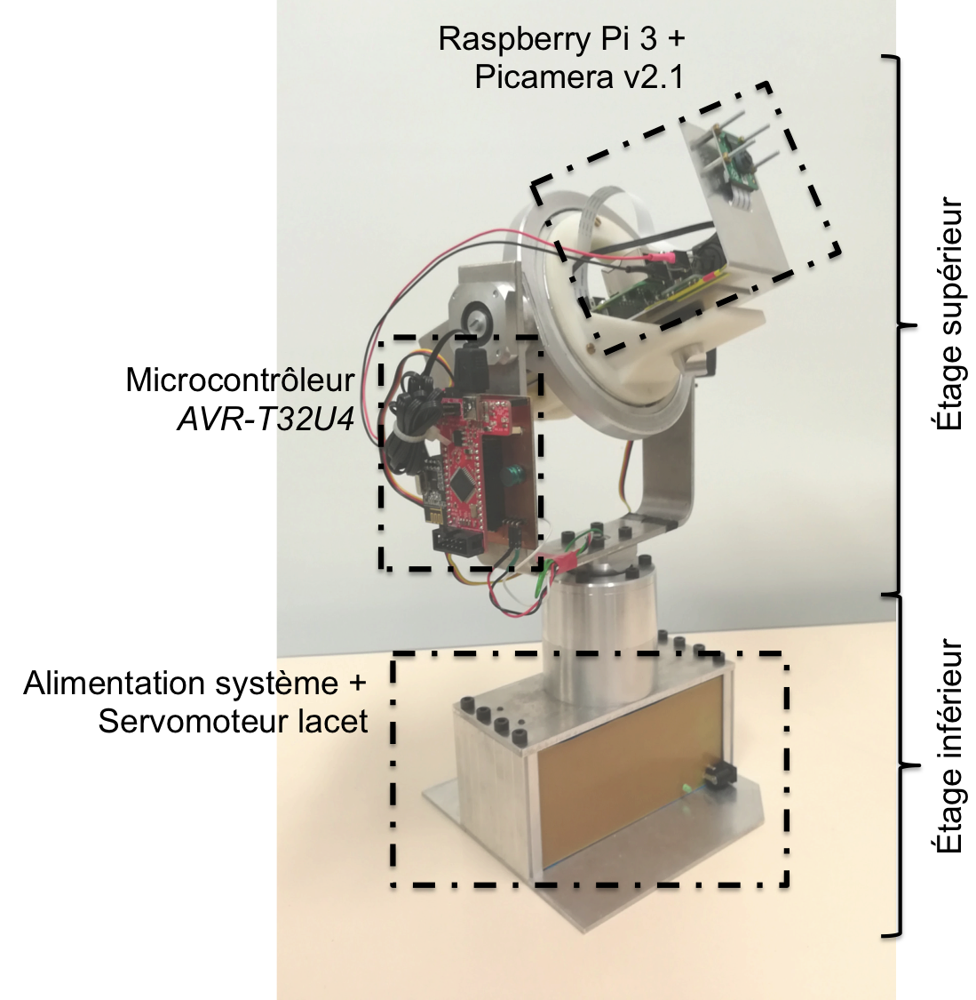

# PiWebcam
Ce projet, proposé en M2 FeSUP GE à l'École Normale Supérieure Paris-Saclay, a pour objectif de réaliser un système permettant de commander l’orientation d’une webcam à partir d’un serveur web embarqué. Il se base sur l'utilisation d'une *Raspberry Pi 3* et d'un microcontrôleur *AVR-T32U4* (similaire à une *Arduino Leonardo*).



Nous décrirons dans ce manuel le fonctionnement du système et nous détaillerons son installation et sa configuration.

La chronologie adoptée sera la suivante :
1. Description globale du système ;
2. Configuration du microcontrôleur *AVR-T32U4* ;
3. Installation et configuration de l'ensemble du système Linux sur *Raspberry Pi 3*.

## Description globale du système
Le système PiWebcam répond à la problématique suivante.
> Piloter une webcam à distance en commandant sa direction et son zoom à l’aide d’un serveur embarqué.

La partie matériel, nommé *Cadan 3 axes* et permettant l'orientation de la caméra, est issue dans projet ultérieur. Seul l'étage d'alimentation a été révisé et une *Raspberry Pi 3* + *PiCamera v2.1* ajoutées. Le diagramme de définition de bloc suivant permet de décomposer le système *PiWebcam* en différents sous-systèmes que nous décrirons dans ce document.


### Cadan 3 axes
Ce sous-système est composé de 2 servomoteurs (*HS-5565MH*) commandés en position assurant la rotation de la caméra autour du roulis et du tangage, et d'un servomoteur (*HS-805BB*) modifié assurant la rotation de la caméra autour du lacet. Ce dernier est commandé en en vitesse et permet une rotation totale de la caméra autour de son axe puisque sa butée mécanique a été retirée et son potentiomètre de recopie remplacé par un pont diviseur de tension.



Le schéma suivant décrit sommairement le système.



La liaison électrique entre l'étage supérieur et inférieur est assuré par des contacts glissants.

L’étage d'alimentation est situé dans la botte du système et est assuré par 2 alimentations à découpage (*LM2596* et *MP2307*) délivrant (respectivement) 5V et 7V. Les fichers *EAGLE* de cet étage étant disponible dans l'archive du projet.
* Les 5V permettent l’alimentation du servomoteur inférieure assurant la rotation autour du lacet ;
* Les 7V permettent l’alimentation des servomoteurs restants, du microcontrôleur, et de la Raspberry. Deux régulateurs linéaires (*L7805CV* et *79ABN05A*) permettent de fournir les 3.3V nécessaire au microcontrôleur et une 3ième alimentation à découpage (*MP2307*) permet de fournir 5V à la Raspberry. Sur cette dernière alimentation, une capacité de 2200uF a été ajoutée en entrée pour palier à d'éventuellement chute de tension que imposer les servomoteurs.

Le schéma suivant illustre la répartion de l'alimentation au sein du système.


La carte de développement utilisé est une *AVR-T32U4* dont l'architecture est inspiré d’une *Arduino Leonardo*. Elle peut être programmée à partir de l’*IDE Arduino*.
Le rôle du microcontrôleur est d'assurer le pilotage des 3 servomoteurs. Les différents pins utilisés de la carte sont présentés sur le schéma suivant.


La communication entre la Raspberry et le microcontrôleur peut être assurée par différents types de liaison (I2C, SPI, UART). La liaison série UART à travers le câble USB a été retenue pour 2 raisons principales : sa facilité de mise en oeuvre et la possibilité de flasher l'*AVR-T32U4* à partir de la Raspberry.

### Raspberry Pi 3 + PiCamera
La *Raspberry Pi 3* hébergera le serveur à partir duquel l'utilisateur devra se connecter pour piloter le système et visualiser le flux vidéo de la *PiCamera v2.1* (cette caméra a une résolution de 8 mégapixels permettant la mise en oeuvre d'un zoom numérique).

Le serveur diffusera une interface graphique dans lequel le flux vidéo sera streamé. Des boutons permettront de transmettre des ordres au différents servomoteurs via une liaison série entre la Raspberry et le microcontrôleur.

Un screenshot de l'interface graphique vous est présenté ci-dessous.

??CAPTURE D'ECRAN DE L'INTERFACE

Afin de mieux visualiser les flux d'informations, le schéma ci-dessous illustre les flux principaux.

??SCHEMA FLUX INFO


## Configuration du microcontrôleur *AVR-T32U4*
Pour configurer le microcontrôleur *AVR-T32U4*, il est nécessaire de télécharger l'[IDE Arduino](https://www.arduino.cc/en/Main/Software). Il ne vous restera plus qu'à flasher la carte avec le code *.ino* disponible dans le dossier `Arduino/sketch_mar28a` (en choissisant le type de board : *Arduino Leonardo*).

Par défaut, ce code permet de commander les servomoteurs via une communication unidirectionnelle série UART vers le port série `Serial0` du microcontrôleur à la vitesse de *9600 baud*.

Les messages à envoyer sont de simples octets répertoriés dans le tableau ci-dessous.

| Octet | Signification                                   |
| ----- | ----------------------------------------------- |
| `#`   | Retour à la position d'origine                  |
| `@`   | Stopper le mouvement et maintenir la position   |
| `U`   | Rotation autour du tangage dans le sens positif |
| `D`   | Rotation autour du tangage dans le sens négatif |
| `R`   | Rotation autour du lacet dans le sens positif   |
| `L`   | Rotation autour du lacet dans le sens positif   |
| `W`   | Rotation autour du roulis dans le sens positif  |
| `V`   | Rotation autour du roulis dans le sens négatif  |

Il est possible d'envoyer un ordre similtanément aux 3 servomoteurs en transmettant l'octet `#` suivit respectivement des positions angulaires des servomoteurs associé au roulis, au tangage et la vitesse angulaire du servomoteur associé au lacet, en séparant les données par un caractère quelconque : par exemple `#350/-260/40`.

## Installation et configuration de l'ensemble du système Linux sur *Raspberry Pi 3*
1. Installation de Raspbian ;
2. Configuration du point d’accès Wifi ;
3. Configuration du streaming vidéo pour une *PiCamera* ;
4. Installation du serveur *nweb* modifié ;
5. Configuration de la communication série entre l'Arduino et Linux TTY ;
6. Configuration du lancement automatique des différents processus au démarrage du système.

Une fois configuré, l'interface de pilotage est accéssible à l'adresse `192.168.3.1:8081` sous réserve d'être connecté au réseau Wifi `PiWebcam` (mot de passe : `mdppiwebcam`) généré par le système.

### Installation de Raspbian
Pour télécharger l'image, rendez-vous sur la [page officiel](https://www.raspberrypi.org/downloads/raspbian/).
Suivez le [guide d'installation](https://www.raspberrypi.org/documentation/installation/installing-images/) si vous ne savez pas (ou plus) comment installer cette image sur une carte SD.

### Configuration du point d’accès Wifi
La configuration du point d'accès Wifi est inspiré de [ce tutoriel](https://www.g33k-zone.org/post/2016/05/11/Configurer-le-Raspberry-Pi-en-point-d-acc%C3%A8s-Wifi).

Cette configuration est valable pour une *Raspberry Pi 3* disposant d'un module Wifi intégré. Il est cependant possible d'effectuer une configuration similaire sur un autre modèle à l'aide d'un dongle Wifi.

**Remarque :** Pour effectuer cette configuration, il est nécessaire d'être directement connecté à la Raspberry avec un moniteur, un clavier + sourie, et une connection internet.

Commencez par installer les packages *dnsmasq* et *hostapd*.
```
sudo apt-get install dnsmasq hostapd
```

La première étape consiste à forcer l'adresse IP pour le point d'accès. Par défaut, le wifi de Raspberry étant en *dhcp*, nous allons devoir éditer `/etc/dhcpcd.conf` pour forcer une adresse IP statique (`192.168.3.1` dans notre cas), en ajoutant les lignes suivantes :
```
interface wlan0  
   static ip_address=192.168.3.1/24
```

Ensuite, nous allons bloquer la négociation automatique de bail dans le fichier `/etc/network/interfaces`.
Il faut rechercher le bloc suivant :
```
allow-hotplug wlan0  
iface wlan0 inet manual  
 #   wpa-conf /etc/wpa_supplicant/wpa_supplicant.conf
```

 Il suffit de commenter la ligne d'appel à `wpa_supplicant.conf` (en ajoutant le `#`).

Nous pouvons maintenant redémarrer le wifi à l'aide de la commande suivante.
```
sudo service dhcpcd restart
```

*hostapd* est le logiciel qui permet de gérer le point d'accès, il est donc le coeur de notre système. Sa configuration se fait dans le fichier `/etc/hostapd/hostapd.conf`
```
# Nom de l'interface wifi (celle par défaut)
interface=wlan0
# Utilisation du driver nl80211,
driver=nl80211
# Nom du réseau wifi (SSID)
ssid=PiWebcam
# Mode du wifi (bande 2.4GHz)
hw_mode=g
# Canal 6
channel=6
# Activer le 802.11n
ieee80211n=1
# Activer le WMM
wmm_enabled=1
# Activer les canaux 40MHz avec 20ns d'intervalle
ht_capab=[HT40][SHORT-GI-20][DSSS_CCK-40]
# Accepter toutes les adresses MAC (pas de restriction d'appareil)
macaddr_acl=0
# Utiliser l'authentification WPA
auth_algs=1
# Ne pas diffuser le SSID
ignore_broadcast_ssid=0
# Utiliser WPA2
wpa=2
# Utiliser une clé partagée
wpa_key_mgmt=WPA-PSK
# Mot de passe du réseau
wpa_passphrase=mdppiwebcam
# Utilisation d'AES plutôt que de TKIP
rsn_pairwise=CCMP
```

Nous pouvons alors à présent tester le fonctionnement du point d'accès.
```
sudo /usr/sbin/hostapd  /etc/hostapd/hostapd.conf
```
Cette commande lance le point d'accès et permet d'avoir le log d'activité directement dans la console. Avec un équipement wifi (gsm, tablette, portable, ...), essayez de vous connecter au réseau `PiWebcam`, normalement la tentative de connexion apparaît.

Une fois que le point d'accès fonctionne, coupez le (*Ctrl+C*) et placez le en démarrage automatique, en éditant le fichier `/etc/default/hostapd`.
```
#DAEMON_CONF=""         =>           DAEMON_CONF="/etc/hostapd/hostapd.conf"
```

*dnsmasq* est un petit serveur DNS qui intègre un serveur *DHCP*. Il permettra d'attribuer les adresses IP aux clients qui se connecteront sur le point d'accès.
Sauvegardez son fichier de configuration initial (`/etc/dnsmasq.conf`) puis créez en une nouvelle version :
```
# Interface à utiliser
interface=wlan0
# Limiter le fonctionnement à l'interface déclarée
bind-interfaces
# Transférer les requêtes DNS sur les DNS d'OpenDns
server=208.67.222.222
# Ne pas forwarder les requêtes "locales" (sans nom de domaine)
domain-needed
# Fausse résolution inverse pour les réseaux privés. Toutes les requêtes DNS inverses pour des adresses IP privées (ie 192.168.x.x, etc…) qui ne sont pas trouvées dans /etc/hosts ou dans le fichier de baux DHCP se voient retournées une réponse “pas de tel domaine” (”no such domain”) au lieu d’être transmises
bogus-priv
# Plage DHCP : on attribuera les adresses IP entre 192.168.3.50 et 192.168.3.150 pour une durée de 12h
dhcp-range=192.168.3.50,192.168.3.150,12h
```

Vous avez actuellement un point d'accès fonctionnel mais limité au réseau local. La suite de ce tutoriel est facultative si vous ne souhaitez pas d'accès à internet via votre Raspberry.

Nous allons utiliser *iptables* pour ajouter des règles de routage.

Il faut commencer par modifier les règles de sécurité dans `/etc/sysctl.conf` pour autoriser le transfert IPv4 (ou IP forwarding) en décommantant la ligne suivante.
```
net.ipv4.ip_forward=1
```

Cette modification ne sera prise en compte qu'au prochain redémarrage de votre Raspberry, mais il est possible de forcer son activation immédiate à l'aide de la commande suivante.
```
sudo sh -c "echo 1 > /proc/sys/net/ipv4/ip_forward"
```

Maintenant que le transfert IPv4 est autorisé, nous allons créer les règles qui vont transférer les requêtes Wifi vers le port ethernet en excécutant les commandes suivantes.
```
sudo iptables -t nat -A POSTROUTING -o eth0 -j MASQUERADE  
sudo iptables -A FORWARD -i eth0 -o wlan0 -m state --state RELATED,ESTABLISHED -j ACCEPT  
sudo iptables -A FORWARD -i wlan0 -o eth0 -j ACCEPT
```

Pour que ces règles soient appliquées à chaque démarrage, nous allons commencer par les sauvegarder dans un fichier `/etc/iptables.ipv4.nat`.
```
sudo sh -c "iptables-save > /etc/iptables.ipv4.nat"
```

Ensuite, nous allons créer un fichier qui sera appelé automatiquement au démarrage du serveur *dhcp*
```
sudo echo "iptables-restore < /etc/iptables.ipv4.nat" > /lib/dhcpcd/dhcpcd-hooks/70-ipv4-nat
```

Pour pouvoir tester votre système sans avoir à le rebooter, il suffit de lancer les daemons manuellement.
```
sudo service hostapd start  
sudo service dnsmasq start
```

Vous disposez à présent dans point d'accés Wifi via la Raspberry.

### Configuration du streaming vidéo pour une *PiCamera*
Pour le streaming vidéo, nous utilisons le package *mjpg-streamer*. Pour plus d'informations, suivez [ce lien](https://doc.ubuntu-fr.org/mjpg-streamer).

Avant de commencer, assurez vous que le package *subversion* est bien installé.
```
sudo apt-get install subversion
```

L'installation de *mjpg-streamer* peut alors commencer.
```
sudo apt-get install libjpeg62-dev
svn checkout svn://svn.code.sf.net/p/mjpg-streamer/code/  mjpg-streamer
cd
make
sudo make install
```

Pour pouvoir lancer le streaming vidéo, il faut charger le module `bcm2835-v4l2` à l'aide de la commande suivante à chaque démarrage de la Raspberry. Pour plus d'informations, consultez [ce lien](http://www.epingle.info/?p=3224).
```
sudo modprobe bcm2835-v4l2
```

Pour éviter d’avoir à exécuter cette commande à chaque démarrage, il suffit d’ajouter le module `bcm2835-v4l2` à l’ensemble des modules lancés par Linux au démarrage en ajoutant le nom du module à la fin du fichier  `/etc/modules`.

Le streaming vidéo se lance à l'aide de la commande suivante.
```
mjpg_streamer -i “/usr/local/lib/input_uvc.so -d /dev/video0 -f 24 -r 320x180” -o “/usr/local/lib/output_http.so -n -w /usr/local/www -p 8001”
```
La vérification de l'existence de `/dev/video0` permet de savoir sur le module s’est bien lancer au démarrage.

Le flux vidéo de la *PiCamera* devrait à présent être accessible à l'adresse `192.168.3.1:8001`.

### Installation du serveur *nweb* modifié
La serveur web mis en oeuvre repose sur le serveur *nweb* proposé par [Ankush Agarwal](https://github.com/ankushagarwal/nweb). Nous l'avons légèrement modifié pour qu'il prennent en compte la gestion de *cgi*.

Pour l'installer, placez le fichier `nweb23.c` et le dossier `serveur` contenant le site dans un répertoire sensible (et non pas dans un répertoire système comme `/` ou `/temp`). Par exemple dans `/home`. Puis rendez le dossier lisible.
```
chmod ugo+r /home/serveur
```
Compilez ensuite le serveur *nweb* et rendez le executable.
```
cc /home/nweb23.c -o /home/nweb
chmod r+x /home/nweb
```
Décidez ensuite du numéro du port que vous utiliserez (ici *8081*). Puis lancez *nweb* à l'aide de la commande suivante.
```
/home/nweb 8081 /home/serveur
```

Voilà, le serveur *nweb* fonctionne à présent et l'interface de pilotage du système *PiWebcam* est disponile à l'adresse `192.168.3.1:8081`

### Configuration de la communication série entre l'Arduino et Linux TTY
Pour configurer la connection Série entre la Raspberry et le microcontrôleur avec la bonne parité, vitesse... excécutez la commande suivante. Pour plus d'information, consultez [ce lien](http://playground.arduino.cc/Interfacing/LinuxTTY).
```
stty -F /dev/ttyACM0 cs8 9600 ignbrk -brkint -icrnl -imaxbel -opost -onlcr -isig -icanon -iexten -echo -echoe -echok -echoctl -echoke noflsh -ixon -crtscts
```

Pour envoyer un message de type *String* au microcontrôleur, nous utiliserons les commandes :
```
#avec fin de ligne
echo "Hello Arduino" > /dev/ttyUSB0

#sans fin de ligne
echo -n "Hello" > /dev/ttyUSB0
```

Pour lire un message de type String envoyé du microcontrôleur, nous utiliserons la commande :
```
tail -f /dev/ttyUSB0
```

### Lancement des différents processus au démarrage de la Raspberry
Le lancement du serveur *nweb* et du streaming vidéo au démarrage de la Raspberry se fait à l'aide du fichier `lancementServeur.sh`. (Nous supposerons que ce fichier disponible dans l'archive du projet et se trouve dans `/home`).

Déplacez le script shell dans le répertoire `/etc/init.d` qui contient les différents scripts lancés au démarrage, et rendait le executable via les commandes suivantes.

```
sudo mv /home/lancementServeur.sh /etc/init.d/lancementServeur
sudo chmod r+x /etc/init.d/lancementServeur
```

Les liens symboliques associés au fichier `lancementServeur` pour son démarrage et son arrêt au lancement et à l'arrêt de la Raspberry sont générés à l'aide de la commande suivante.
```
sudo update-rc.d lancementServeur defaults
```
Le lien symbolique créé dans `rc3.d` est `S02lancementserveur`. Nous pouvons renommer le lien en `S99lancementserveur` pour qu'il se lance en dernier.

À présent le système *PiCamera* est entièrement installé et configuré.

Enjoy & have a lot of fun...
